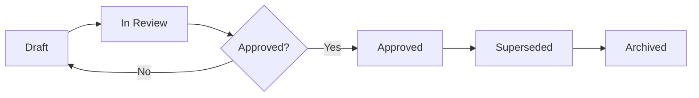

# Artifact Lifecycle

## Purpose
Define how artifacts move from draft to approved to archived.

## Lifecycle States
1. **Draft**: Initial working version under active edits.
2. **In Review**: Shared for stakeholder/lead feedback.
3. **Approved**: Accepted as the current source of truth.
4. **Superseded**: Replaced by a newer approved artifact.
5. **Archived**: Retained for history/reference only.

## Artifact Categories
- **Canonical artifacts** live in `02-phase-artifacts` and can move through `Draft -> In Review -> Approved -> Superseded -> Archived`.
- **Delivery-instance artifacts** live in `03-delivery-records` and typically move through `Draft -> In Review -> Approved -> Archived`.
- **Evidence links** are recorded in the relevant sprint or release instance by default; create local evidence folders only when attachments must live in the workspace.

## Delivery Record Entry Criteria
- **Draft -> In Review**
  - Metadata completed
  - Canonical links validated
  - Index and registry updated
  - Evidence links added or explicitly marked pending
- **In Review -> Approved**
  - Required reviewers have completed review
  - Scope, quality, and delivery notes are internally consistent
  - Sign-off section reflects the same decision as the metadata state
- **Approved -> Archived**
  - Release or sprint is closed
  - Archive destination recorded in `artifact-registry.md`
  - `archive.md` updated with the archival note when applicable

## Review Cadence
- Review sprint records during sprint planning, sprint review, and sprint closure.
- Review release packs at release planning start, readiness review, and release closure.
- Review `INDEX.md` and `artifact-registry.md` monthly to detect drift.
- Run `pnpm agile:check` during the monthly review and after structural delivery-record changes.

## Workflow

## Operational Rules
- Keep only one approved file per artifact type per scope.
- Keep canonical artifacts in `02-phase-artifacts`; do not move sprint-specific execution notes into canonical files.
- Keep release and sprint instances in `03-delivery-records` and archive them after closure.
- Use `Superseded` mainly for canonical artifacts; use `Archived` as the normal terminal state for closed release and sprint packs.
- Use `archive.md` as the default archive tracker until archive volume justifies a dedicated folder split.
- Keep record metadata state, sign-off decision, and registry state aligned.
- Record major changes in file-level "Change Notes" section if needed.
- Update `INDEX.md` and `artifact-registry.md` when status or location changes.
