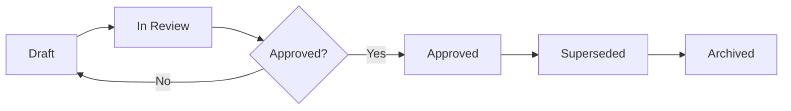

# Artifact Lifecycle

## Purpose
Define how artifacts move from draft to approved to archived.

## Lifecycle States
1. **Draft**: Initial working version under active edits.
2. **In Review**: Shared for stakeholder/lead feedback.
3. **Approved**: Accepted as the current source of truth.
4. **Superseded**: Replaced by a newer approved artifact.
5. **Archived**: Retained for history/reference only.

## Workflow

## Operational Rules
- Keep only one approved file per artifact type per scope.
- Record major changes in file-level "Change Notes" section if needed.
- Update `INDEX.md` when status or location changes.
