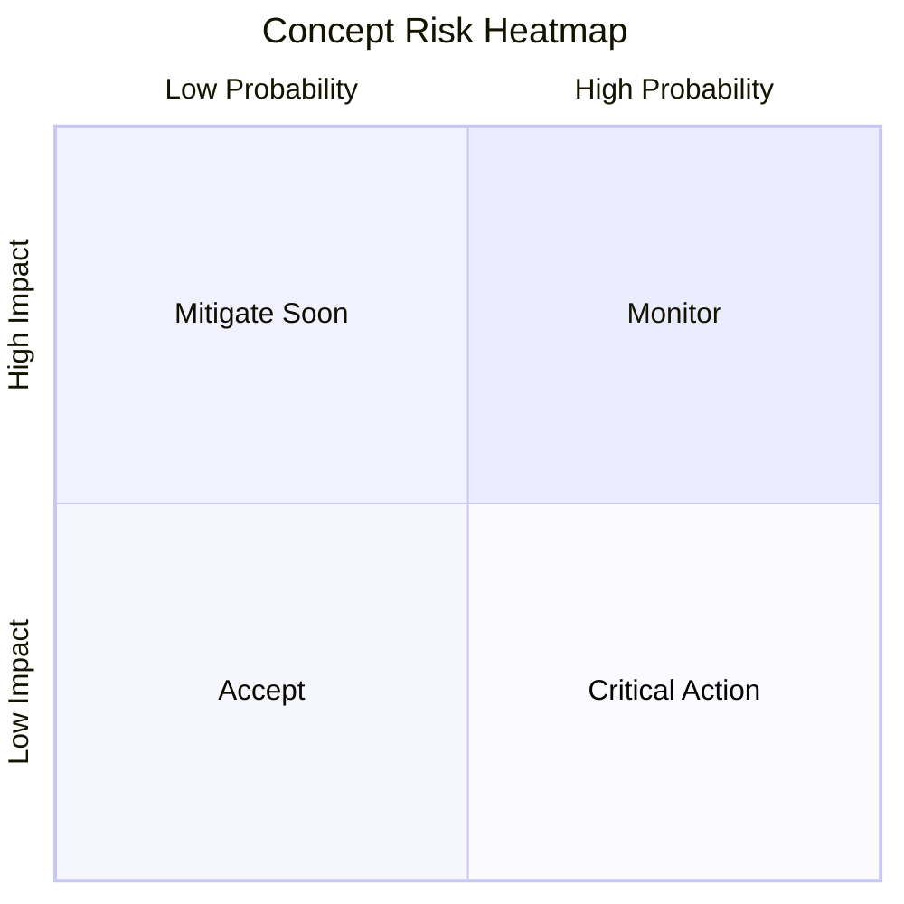

# Concept Artifacts Template

## Product Vision Board
- Product:
- Owner:
- Vision statement:
- Target users:
- User needs:
- Key features:
- Business goals:
- Success metrics:

## Initial Product Backlog (Epics)
| Priority | Epic ID | Epic Name | Outcome | Estimate | Dependencies |
|---|---|---|---|---|---|
| High | EPIC-001 |  |  |  |  |

## Feasibility and Risk Snapshot
| Dimension | Assessment | Notes |
|---|---|---|
| Technical |  |  |
| Schedule |  |  |
| Resource |  |  |
| Financial |  |  |

## Risk Heatmap

