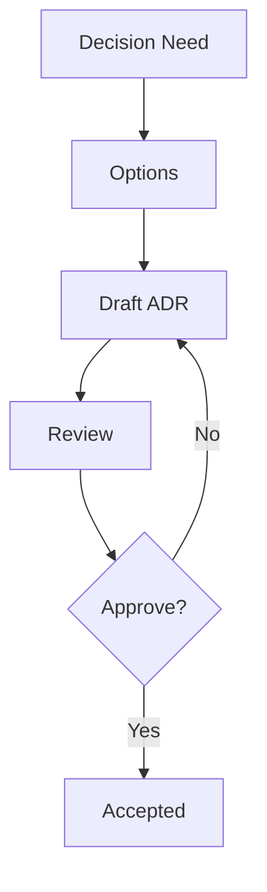

# Inception Artifacts Template

## ADR Log
| ADR ID | Title | Status | Date | Owner |
|---|---|---|---|---|
| ADR-001 |  | Proposed |  |  |

## User Stories and Acceptance Criteria
### US-001
- Story: As a [role], I want [goal], so that [benefit].
- Acceptance Criteria:
  - Given...
  - When...
  - Then...

## Technical Blueprint
- Stack:
- Directory strategy:
- Non-functional targets:
- Deployment target:
- Release cadence:

## Decision Flow

