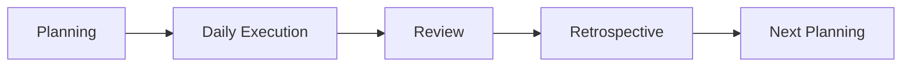

# Iteration Artifacts Template

## Sprint Goal
- Sprint name:
- Sprint dates:
- Goal statement:
- Success criteria:

## Sprint Backlog
| Item ID | Story | Task | Owner | Estimate | Status |
|---|---|---|---|---|---|
| SB-001 |  |  |  |  | Todo |

## Definition of Done
- Code reviewed
- Quality checks pass
- Tests pass
- Documentation updated
- Acceptance confirmed

## Ceremonies Tracker
| Ceremony | Date/Time | Participants | Objective |
|---|---|---|---|
| Planning |  |  |  |
| Standup |  |  |  |
| Review |  |  |  |
| Retro |  |  |  |

## Sprint Cadence

