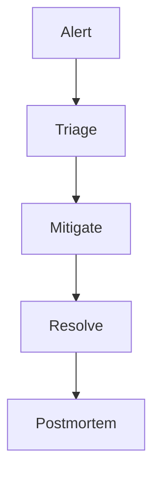

# Maintenance Artifacts Template

## Maintenance Backlog
| Item ID | Category | Description | Priority | SLA | Owner | Status |
|---|---|---|---|---|---|---|
| MB-001 | Defect |  | High |  |  | Open |

## Monitoring and Incident Response
| Signal | Threshold | Severity | Action |
|---|---|---|---|
| Error rate spike |  | High |  |
| LCP degradation |  | Medium |  |

## Continuous Improvement Plan
| Theme | Baseline | Target | Owner | Due |
|---|---|---|---|---|
| Build speed |  |  |  |  |
| Test reliability |  |  |  |  |

## Incident Flow

