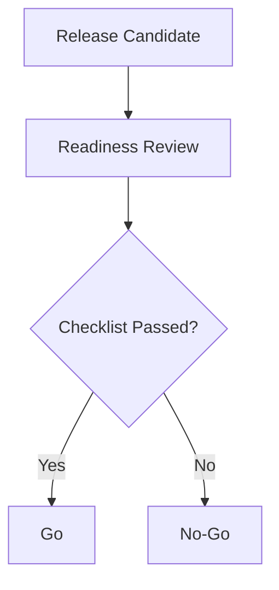

# Release Artifacts Template

## QA Strategy and Test Plan
| Test Type | Objective | Tooling | Entry Criteria |
|---|---|---|---|
| Unit |  |  |  |
| Integration |  |  |  |
| E2E |  |  |  |
| Accessibility |  |  |  |

## Test Cases
| TC ID | Scenario | Expected Result | Owner |
|---|---|---|---|
| TC-01 |  |  |  |

## Release Notes
- Version:
- Release date:
- Summary:
- New features:
- Improvements:
- Fixes:
- Known issues:

## Go/No-Go Checklist
| Area | Check | Status | Owner |
|---|---|---|---|
| Quality |  |  |  |
| Defects |  |  |  |
| Performance |  |  |  |
| Security |  |  |  |

## Deployment Decision Flow

