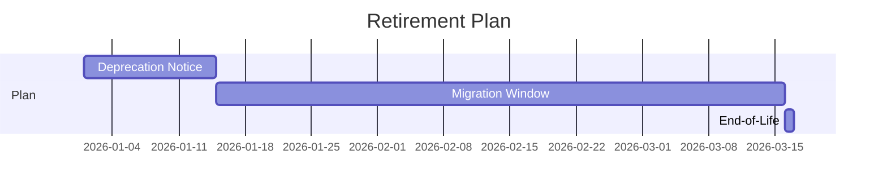

# Retirement Artifacts Template

## Retirement Strategy
- Trigger(s):
- Scope:
- Impact summary:
- Timeline:
- Exit criteria:

## Migration Runbook
1. Inventory consumers
2. Classify migration waves
3. Execute pilot
4. Roll out all waves
5. Validate and sign off

## Decommission Checklist
| Area | Task | Owner | Status |
|---|---|---|---|
| Codebase |  |  | Pending |
| Tooling |  |  | Pending |
| Security |  |  | Pending |
| Governance |  |  | Pending |

## Communication Plan
| Audience | Message | Channel | Timing | Owner |
|---|---|---|---|---|
| Engineering |  |  |  |  |
| Stakeholders |  |  |  |  |

## Retirement Timeline

