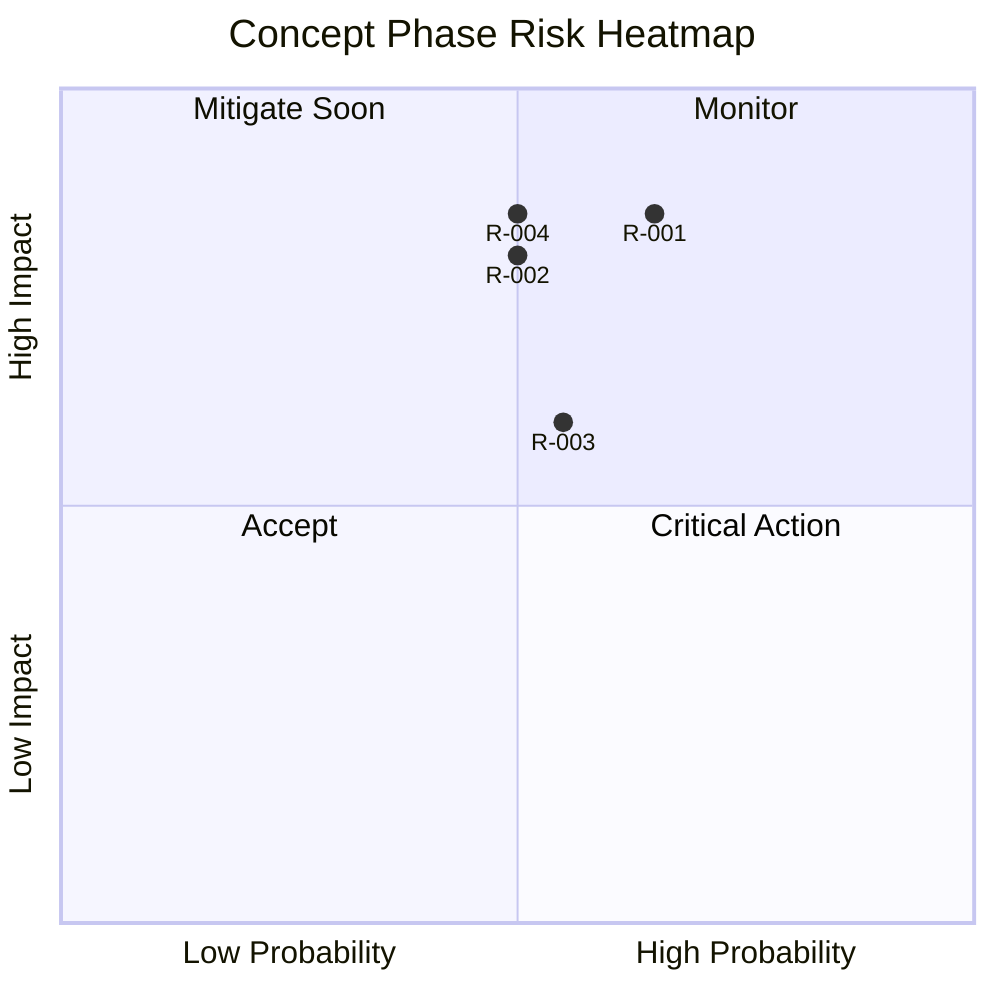

# Feasibility and Risk Snapshot

## Objective
Assess delivery viability for the starter template and identify early risk controls before detailed planning.

## Feasibility Dimensions
| Dimension | Assessment | Notes |
|---|---|---|
| Technical | High | Stack choices are mature (Next.js, Tailwind, Storybook) |
| Operational | Medium | Requires cross-functional alignment and standards adoption |
| Schedule | Medium-High | 12-week target with 80% confidence based on similar platform work |
| Resource | Medium | Core squad of 6 with shared QA support |
| Financial | High | Funded under FY26 frontend platform modernization budget |

## Risk Register (Concept-Level)
| Risk ID | Risk | Probability | Impact | Mitigation | Owner |
|---|---|---|---|---|---|
| R-001 | Scope expansion delays baseline delivery | Medium | High | Strict MVP scope and backlog hygiene | Product Owner |
| R-002 | Inconsistent architecture adoption | Medium | High | ADR governance and template docs | Tech Lead |
| R-003 | Performance regressions during feature growth | Medium | Medium | Lighthouse gates and budget thresholds | QA/FE Lead |
| R-004 | Accessibility gaps in reusable components | Medium | High | a11y checks in Storybook and CI | UX + QA |
| R-005 | Third-party dependency breaking changes | Medium | Medium | Weekly dependency updates and lockfile governance | FE Lead |

## Risk Heatmap

## Go/No-Go Recommendation
- **Recommendation:** Go (with controls)
- **Conditions:**
  - Confirm team capacity and owners
  - Establish minimum quality gates for performance and accessibility
  - Lock MVP scope for first release window
