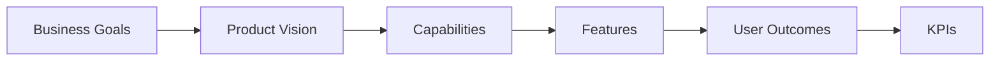

# Product Vision Board

## Product
- **Name:** Next.js Frontend Starter Template
- **Version Scope:** v1.0-v1.2 foundation releases
- **Owner:** Frontend Platform Product Owner

## Vision Statement
Create an industry-standard frontend foundation that accelerates delivery, improves consistency, and bakes in performance, accessibility, and developer experience from day one.

## Target Users
- Internal frontend engineers
- Agency delivery teams
- QA engineers and design system contributors

## User Needs
- Fast project initialization with minimal setup friction
- Standardized architecture for maintainability
- Built-in SEO, accessibility, and performance defaults
- Reliable CI/CD guardrails for every new frontend initiative

## Key Product Features (3-5)
1. Next.js 15 with App Router and server-first patterns
2. Tailwind CSS v4 theming foundation
3. Reusable component architecture and Storybook coverage
4. NextAuth baseline with provider-ready configuration
5. Typed API integration baseline via centralized service clients

## Business Goals
- Reduce initialization time by 40%
- Increase cross-project UI consistency to 85% design-token adherence
- Reduce onboarding time for new engineers to under 2 business days

## Success Metrics
- Time-to-first-feature: <= 1.5 developer days
- Lighthouse Performance score: >= 90
- Accessibility score: >= 95
- Storybook coverage: 100%

## Vision Alignment Map

## Assumptions and Constraints
- Team has baseline expertise in React and Next.js
- CI/CD infrastructure is available
- Budget fixed to existing platform allocation; delivery window capped at 12 weeks
