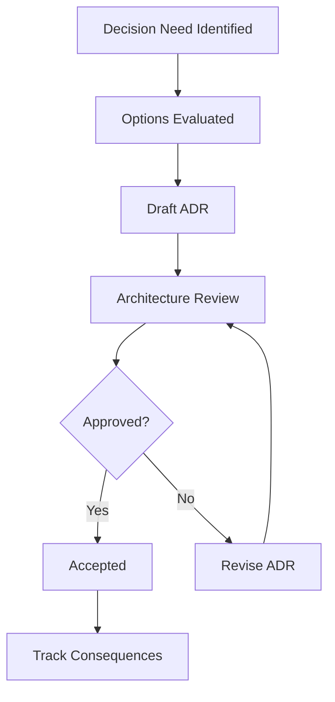

# Architecture Decision Record (ADR) Log

## ADR Governance
- **Format:** MADR-style summary
- **Decision Authority:** Frontend Architecture Council (chaired by Tech Lead)
- **Review Cadence:** Weekly architecture review every Tuesday

## ADR Index
| ADR ID | Title | Status | Date | Owner |
|---|---|---|---|---|
| ADR-001 | Use Tailwind CSS v4 for styling | Accepted | 2026-04-27 | FE Architect |
| ADR-002 | Use Next.js App Router for routing | Accepted | 2026-04-27 | FE Architect |
| ADR-003 | Use Storybook 8 for component documentation | Accepted | 2026-04-27 | FE Lead |
| ADR-004 | Adopt shadcn/ui as the baseline component system | Accepted | 2026-04-27 | FE Lead |
| ADR-005 | Persist theme preference via cookie-first strategy with localStorage fallback | Proposed | 2026-04-29 | FE Lead |
| ADR-006 | Testing framework standardization | Proposed | 2026-04-29 | QA Lead |
| ADR-007 | Keep implementation scope frontend-only (no backend services) | Accepted | 2026-04-27 | Product + FE Lead |
| ADR-008 | Plan delivery using 3 releases and 6 sprints | Accepted | 2026-04-27 | Product Owner |

## ADR Template
## [ADR-ID] [Title]
### Status
[Proposed | Accepted | Superseded]

### Context
Need a documented architecture decision that balances speed, maintainability, and long-term scalability while fitting team skill levels and existing CI/CD constraints.

### Decision
Select the highest-value option using weighted criteria: performance, developer experience, maintainability, and migration effort.

### Consequences
- Positive: Clear rationale and strong onboarding context for future teams.
- Negative: Slight overhead in writing and reviewing ADRs.
- Trade-offs: Accept slower initial decision velocity to improve long-term consistency and reduce rework.

## Decision Flow

