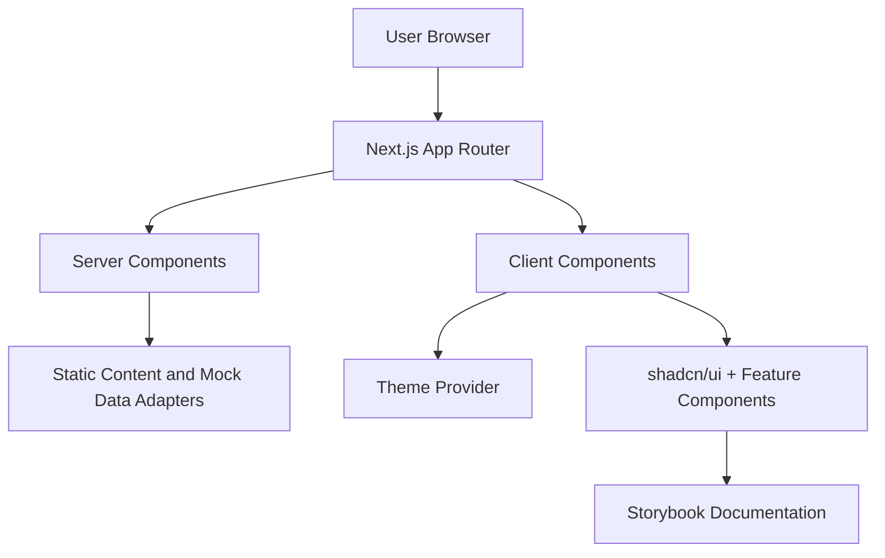

# Technical Blueprint

## Objective
Define the initial architecture and working agreements that enable iterative delivery with high quality.

## Scope Boundary
- Frontend-only boilerplate scope (no backend service implementation).
- Authentication and external integrations are treated as interface-ready placeholders, not delivered backend features.

## Baseline Stack
- Next.js 15 (App Router)
- TypeScript
- Tailwind CSS v4
- shadcn/ui component system
- Storybook 8
- Testing: Vitest, React Testing Library, and Playwright

## Directory Blueprint
| Path | Purpose |
|---|---|
| `src/app` | Routes, layouts, loading/error boundaries |
| `src/components/ui` | Reusable primitives |
| `src/components/features` | Domain-level components |
| `src/lib` | Shared utilities and service clients |
| `src/hooks` | Reusable React hooks |
| `src/styles` | Global styling and tokens |

## UI Architecture Standards
- Reusable primitives should be built from approved shadcn/ui components before creating custom equivalents.
- Styling should use semantic Tailwind tokens and shared theme variables to preserve light/dark parity.
- Design system behavior is validated through Storybook stories and visual/a11y checks.

## High-Level Architecture

## Release-Aligned Delivery Slices
- Release 1: scaffolding, testing baseline, landing foundation, onboarding sample, navigation, and base components.
- Release 2: theme toggle, persistence, and dedicated settings page.
- Release 3: Storybook integration, component story coverage, and documentation completion.

## Non-Functional Targets
- Performance: Lighthouse >= 90 on key landing routes
- Accessibility: WCAG level AA conformance
- Reliability: 99.9% monthly availability SLO with 43m error budget
- Security: SAST, dependency scanning, secret scanning, and CSP baseline headers

## Quality Gates
- No critical accessibility violations in Storybook and CI checks.
- No severe visual regressions on baseline components (button, card, form controls, theme toggle).
- No production-blocking security issues from dependency and secret scanning.

## Environment and Delivery
- CI checks: lint, type-check, test, build
- Deployment target: Vercel production with preview deployments per pull request
- Release cadence: Bi-weekly production release with ad-hoc hotfixes
