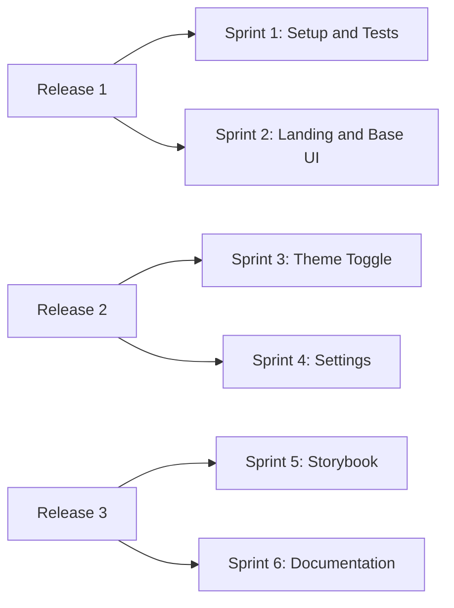

# User Stories and Acceptance Criteria

## Story Authoring Standard
- Format: "As a [role], I want [goal], so that [benefit]"
- Must satisfy INVEST criteria
- Acceptance Criteria must be testable and written as Given/When/Then
- Each story must map to at least one epic and one release-phase test case

## Sprint Allocation (Roadmap-Aligned)
| Sprint | Release | Story IDs |
|---|---|---|
| Sprint 1 | Release 1 | US-101, US-102, US-103 |
| Sprint 2 | Release 1 | US-104, US-105, US-106, US-107 |
| Sprint 3 | Release 2 | US-108, US-109, US-110 |
| Sprint 4 | Release 2 | US-111, US-112, US-113 |
| Sprint 5 | Release 3 | US-114, US-115, US-116 |
| Sprint 6 | Release 3 | US-117, US-118, US-119 |

## Story Backlog (Inception Baseline)
| Story ID | Sprint | Priority | Epic Link | Estimate (SP) | Dependency | Status |
|---|---|---|---|---|---|---|
| US-101 | Sprint 1 | High | EPIC-001 | 5 | None | Draft |
| US-102 | Sprint 1 | High | EPIC-005 | 3 | US-101 | Draft |
| US-103 | Sprint 1 | High | EPIC-007 | 3 | US-101 | Draft |
| US-104 | Sprint 2 | High | EPIC-002 | 5 | US-101 | Draft |
| US-105 | Sprint 2 | High | EPIC-002 | 3 | US-104 | Draft |
| US-106 | Sprint 2 | Medium | EPIC-001 | 5 | US-101 | Draft |
| US-107 | Sprint 2 | Medium | EPIC-002 | 3 | US-104 | Draft |
| US-108 | Sprint 3 | High | EPIC-004 | 5 | US-105 | Draft |
| US-109 | Sprint 3 | High | EPIC-004 | 3 | US-108 | Draft |
| US-110 | Sprint 3 | Medium | EPIC-003 | 3 | US-104 | Draft |
| US-111 | Sprint 4 | High | EPIC-004 | 5 | US-108 | Draft |
| US-112 | Sprint 4 | Medium | EPIC-004 | 3 | US-111 | Draft |
| US-113 | Sprint 4 | Medium | EPIC-003 | 3 | US-111 | Draft |
| US-114 | Sprint 5 | High | EPIC-005 | 5 | US-103 | Draft |
| US-115 | Sprint 5 | High | EPIC-005 | 3 | US-114 | Draft |
| US-116 | Sprint 5 | Medium | EPIC-007 | 3 | US-114 | Draft |
| US-117 | Sprint 6 | High | EPIC-005 | 5 | US-114 | Draft |
| US-118 | Sprint 6 | Medium | EPIC-005 | 3 | US-117 | Draft |
| US-119 | Sprint 6 | Medium | EPIC-005 | 3 | US-117 | Draft |

## Refined User Stories and Acceptance Criteria

### US-101: Standardized Project Structure
- **Story:** As a frontend developer, I want a standardized Next.js App Router folder structure so that I can navigate and scale feature work consistently.
- **Acceptance Criteria:**
  - **Given** a fresh clone, **when** `src/` is inspected, **then** required directories are present and documented.
  - **Given** new route work, **when** route files are created, **then** App Router conventions are used.

### US-102: Local Unit Testing Baseline
- **Story:** As a developer, I want unit testing configured on day one so that regressions are caught early.
- **Acceptance Criteria:**
  - **Given** a new component or utility, **when** tests run, **then** baseline unit tests execute successfully.
  - **Given** CI execution, **when** test stage runs, **then** failures block merge.

### US-103: Quality Gate Pipeline
- **Story:** As a tech lead, I want lint/type/test/build checks enforced so that code quality is consistent.
- **Acceptance Criteria:**
  - **Given** a pull request, **when** CI runs, **then** lint/type/test/build must pass.
  - **Given** a failed check, **when** reviewing status, **then** merge is blocked until fixed.

### US-104: Landing Page Foundation
- **Story:** As a visitor, I want a clear landing page so that I can understand the boilerplate value quickly.
- **Acceptance Criteria:**
  - **Given** the root route loads, **when** content renders, **then** hero/value proposition/CTA sections are visible.
  - **Given** responsive breakpoints, **when** layout is checked, **then** landing page remains readable and usable.

### US-105: Base Components via shadcn/ui
- **Story:** As a frontend engineer, I want header/footer/menu primitives built from shadcn/ui so that UI behavior is consistent.
- **Acceptance Criteria:**
  - **Given** base components are implemented, **when** code is reviewed, **then** shadcn/ui composition is used before custom markup.
  - **Given** style classes are applied, **when** reviewed, **then** semantic tokens are used and hard-coded colors are avoided.

### US-106: Sample Onboarding Page
- **Story:** As a new user, I want a sample onboarding flow so that teams can reuse a practical starter pattern.
- **Acceptance Criteria:**
  - **Given** onboarding route access, **when** user steps through sample flow, **then** progression and completion states are clear.
  - **Given** route transitions, **when** navigation occurs, **then** onboarding state feedback is visible.

### US-107: Responsive Navigation
- **Story:** As a mobile user, I want accessible navigation menus so that I can move through pages easily.
- **Acceptance Criteria:**
  - **Given** viewport < 768px, **when** nav is opened, **then** mobile menu is keyboard accessible.
  - **Given** desktop viewport, **when** nav renders, **then** primary navigation is persistent and clear.

### US-108: Theme Toggle Control
- **Story:** As a user, I want a light/dark toggle so that I can choose my preferred reading mode.
- **Acceptance Criteria:**
  - **Given** the toggle exists, **when** activated, **then** theme switches immediately.
  - **Given** keyboard navigation, **when** toggle receives focus, **then** it is operable and announced correctly.

### US-109: Theme Persistence
- **Story:** As a returning user, I want my chosen theme remembered so that I do not reset preferences each visit.
- **Acceptance Criteria:**
  - **Given** a theme is selected, **when** page reloads, **then** selected theme is restored.
  - **Given** route navigation, **when** moving between pages, **then** theme remains consistent.

### US-110: Theme Performance and Stability
- **Story:** As a product stakeholder, I want theme switching to avoid UX regressions so that quality remains high.
- **Acceptance Criteria:**
  - **Given** initial page render, **when** app hydrates, **then** no visible theme flicker occurs.
  - **Given** visual regression checks, **when** light/dark snapshots compare, **then** no unintended deltas appear.

### US-111: Settings Page Route
- **Story:** As a user, I want a dedicated settings page so that preferences are managed in one place.
- **Acceptance Criteria:**
  - **Given** app navigation, **when** settings is selected, **then** `/settings` route loads successfully.
  - **Given** settings page layout, **when** viewed on mobile/desktop, **then** controls remain usable.

### US-112: Settings Controls
- **Story:** As a user, I want settings controls for personalization so that I can configure my experience.
- **Acceptance Criteria:**
  - **Given** settings page, **when** theme preference is changed, **then** value persists and updates UI.
  - **Given** settings defaults, **when** reset is triggered, **then** defaults are restored.

### US-113: Settings Accessibility
- **Story:** As an accessibility-focused stakeholder, I want settings controls to meet basic a11y standards so that all users can operate them.
- **Acceptance Criteria:**
  - **Given** keyboard-only navigation, **when** traversing controls, **then** focus order and visible focus are correct.
  - **Given** assistive technology, **when** controls are announced, **then** labels and states are meaningful.

### US-114: Storybook Setup
- **Story:** As a developer, I want Storybook integrated so that components can be developed in isolation.
- **Acceptance Criteria:**
  - **Given** project setup, **when** Storybook starts, **then** it runs without manual patching.
  - **Given** Next.js-specific components, **when** rendered in Storybook, **then** they load correctly.

### US-115: Component Story Coverage
- **Story:** As a developer, I want core components to have stories so that reuse is reliable.
- **Acceptance Criteria:**
  - **Given** core component inventory, **when** coverage is reviewed, **then** each core component has at least one story.
  - **Given** story controls, **when** interactions are tested, **then** key props are configurable.

### US-116: Visual Regression Baseline
- **Story:** As QA, I want visual regression checks for component states so that UI drift is caught early.
- **Acceptance Criteria:**
  - **Given** Storybook visual tests, **when** CI runs, **then** critical component snapshots are compared automatically.
  - **Given** unexpected snapshot deltas, **when** review occurs, **then** release is blocked pending approval/fix.

### US-117: Documentation Structure
- **Story:** As a new contributor, I want documentation structured by setup/components/testing so that onboarding is fast.
- **Acceptance Criteria:**
  - **Given** docs index, **when** opened, **then** setup, usage, and testing paths are easy to find.
  - **Given** onboarding docs, **when** followed, **then** contributor can run project and Storybook locally.

### US-118: Component Usage Documentation
- **Story:** As a feature developer, I want component usage examples documented so that implementation is consistent.
- **Acceptance Criteria:**
  - **Given** reusable components, **when** docs are reviewed, **then** usage examples and props are documented.
  - **Given** shadcn/ui composition rules, **when** docs are read, **then** design-system constraints are explicit.

### US-119: Release Documentation Readiness
- **Story:** As a PM, I want release-note and quality-check templates finalized so that releases are repeatable.
- **Acceptance Criteria:**
  - **Given** release templates, **when** reviewed, **then** they include quality gates and owner sign-offs.
  - **Given** sprint-end review, **when** release docs are prepared, **then** stakeholders can approve go/no-go decisions.

## Story Map

## Definition of Ready (Stories)
- Business value and user impact are explicit
- Acceptance criteria are testable in Given/When/Then form
- Dependencies, risks, and owners are identified
- Estimated size fits within one sprint
- Traceability exists from Story to Test Case

## Story Volume Guardrail
- Minimum 3 INVEST-ready stories per sprint.
- Target range 3-5 stories per sprint based on team capacity.
- Any sprint below minimum must include documented rationale and mitigation.
