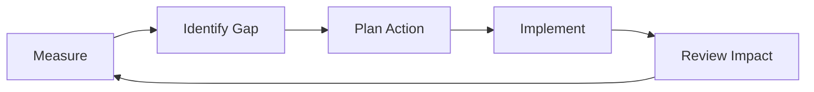

# Continuous Improvement Plan

## Objective
Use production feedback and delivery metrics to continuously improve product quality and team throughput.

## Improvement Inputs
- Retrospective actions
- Incident postmortems
- User feedback and support trends
- Delivery and quality metrics

## Quarterly Improvement Themes
| Theme | Baseline | Target | Owner | Due |
|---|---|---|---|---|
| Build speed optimization | 9m avg CI build | 6m avg CI build | DevOps Lead | 2026-07-31 |
| Test reliability | 92% pass rate | 97% pass rate | QA Lead | 2026-07-31 |
| Accessibility maturity | 88 a11y score | 95 a11y score | UX Engineer | 2026-08-15 |
| Documentation completeness | 70% component docs coverage | 100% component docs coverage | UI Engineer | 2026-08-15 |

## Improvement Loop

