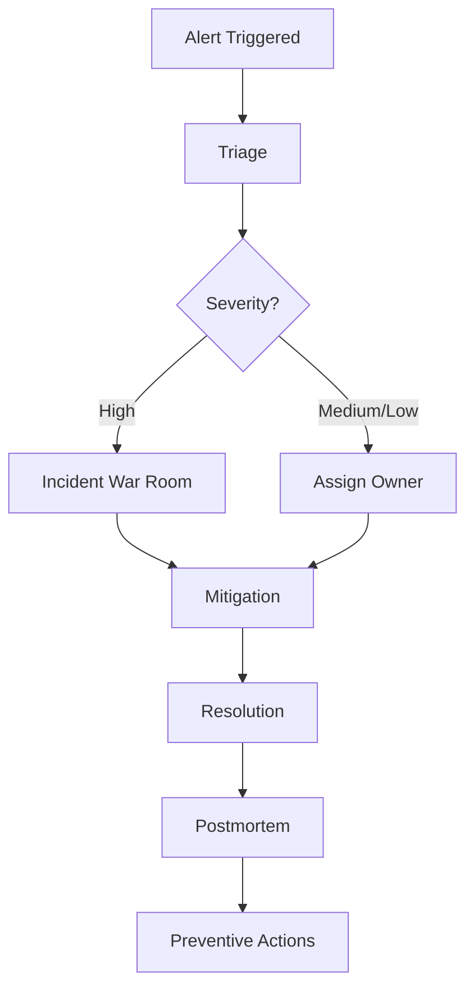

# Monitoring and Incident Response Plan

## Monitoring Scope
- Availability and error rates
- Core Web Vitals trends
- Build and deployment health
- Client-side exception telemetry

## Alerting Matrix
| Signal | Threshold | Severity | On-Call Action |
|---|---|---|---|
| Error rate spike | > 3% in 10 min | High | Start incident triage immediately |
| LCP degradation | > 2800 ms p75 | Medium | Investigate performance regression |
| Deployment failure | Any production failure | High | Roll back and open incident |
| Accessibility violation trend | > 5 critical findings | Medium | Create remediation task |

## Incident Workflow

## Postmortem Template
- Incident ID: INC-2026-001
- Timeline: Detection 09:20, mitigation 09:40, resolution 10:05 (UTC+8)
- Root Cause: Theme preference cookie parsing regression in server-rendered layout
- Corrective Actions: Add schema validation for cookie parsing and regression tests for SSR theme bootstrapping
