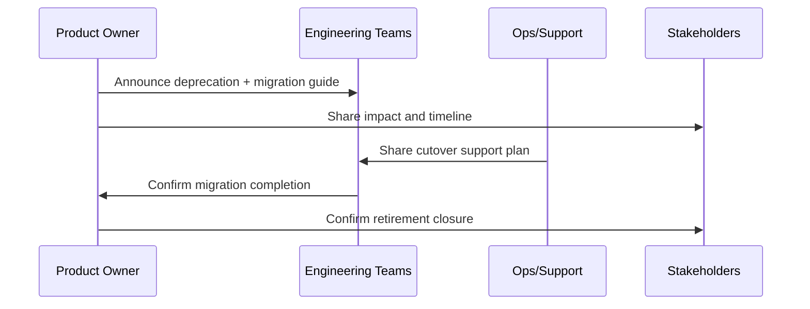

# Decommission Checklist and Communications Plan

## Decommission Checklist
| Area | Task | Owner | Status |
|---|---|---|---|
| Codebase | Archive legacy branches and tags | FE Architect | Pending |
| Tooling | Disable obsolete CI/CD jobs | DevOps Lead | Pending |
| Docs | Mark old docs as deprecated | Technical Writer | Pending |
| Support | Close maintenance queues for retired template | Support Lead | Pending |
| Security | Revoke unused credentials/tokens | Security Engineer | Pending |
| Governance | Record formal end-of-life approval | Product Owner | Pending |

## Communication Plan
| Audience | Message | Channel | Timing | Owner |
|---|---|---|---|---|
| Engineering teams | Deprecation and migration timeline | Engineering All-Hands + Slack #frontend-platform | T-60 days | Product Owner |
| Stakeholders | Risk and delivery implications | Monthly portfolio review + email brief | T-45 days | Delivery Manager |
| Support/Ops | Cutover and escalation process | Ops runbook review meeting + PagerDuty notes | T-30 days | Ops Lead |

## Communication Sequence

## Sign-Off
- Final Approver: VP of Engineering
- Date: 2026-09-30
- Notes: Retirement proceeds after completion of Wave 3 migration and governance sign-off
