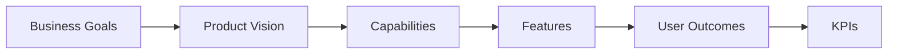

# Product Vision Board

## Product
- **Name:** Next.js Frontend Starter Template
- **Version Scope:** [PLACEHOLDER: Target release baseline]
- **Owner:** [PLACEHOLDER: Product Owner]

## Vision Statement
Create an industry-standard frontend foundation that accelerates delivery, improves consistency, and bakes in performance, accessibility, and developer experience from day one.

## Target Users
- Internal frontend engineers
- Agency delivery teams
- [PLACEHOLDER: Additional personas]

## User Needs
- Fast project initialization with minimal setup friction
- Standardized architecture for maintainability
- Built-in SEO, accessibility, and performance defaults
- [PLACEHOLDER: Org-specific needs]

## Key Product Features (3-5)
1. Next.js 15 with App Router and server-first patterns
2. Tailwind CSS v4 theming foundation
3. Reusable component architecture and Storybook coverage
4. [PLACEHOLDER: Authentication baseline strategy]
5. [PLACEHOLDER: API integration baseline]

## Business Goals
- Reduce initialization time by 40%
- Increase cross-project UI consistency to [PLACEHOLDER: KPI target]
- Reduce onboarding time for new engineers to [PLACEHOLDER: duration]

## Success Metrics
- Time-to-first-feature: [PLACEHOLDER]
- Lighthouse Performance score: >= [PLACEHOLDER]
- Accessibility score: >= [PLACEHOLDER]
- Storybook coverage: [PLACEHOLDER]%

## Vision Alignment Map

## Assumptions and Constraints
- Team has baseline expertise in React and Next.js
- CI/CD infrastructure is available
- [PLACEHOLDER: Budget/timeline constraints]
