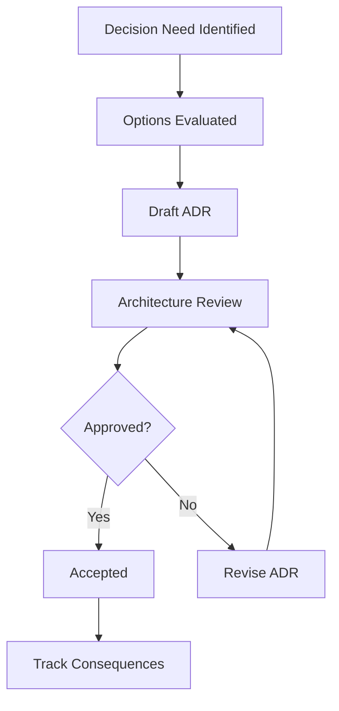

# Architecture Decision Record (ADR) Log

## ADR Governance
- **Format:** MADR-style summary
- **Decision Authority:** [PLACEHOLDER: Architecture Council/Tech Lead]
- **Review Cadence:** [PLACEHOLDER]

## ADR Index
| ADR ID | Title | Status | Date | Owner |
|---|---|---|---|---|
| ADR-001 | Use Tailwind CSS v4 for styling | Accepted | [PLACEHOLDER] | FE Architect |
| ADR-002 | Use Next.js App Router for routing | Accepted | [PLACEHOLDER] | FE Architect |
| ADR-003 | Use Storybook 8 for component documentation | Accepted | [PLACEHOLDER] | FE Lead |
| ADR-004 | Persist theme preference via [PLACEHOLDER] | Proposed | [PLACEHOLDER] | FE Lead |
| ADR-005 | Testing framework standardization | Proposed | [PLACEHOLDER] | QA Lead |

## ADR Template
## [ADR-ID] [Title]
### Status
[Proposed | Accepted | Superseded]

### Context
[PLACEHOLDER: Problem statement and constraints]

### Decision
[PLACEHOLDER: Chosen option]

### Consequences
- Positive: [PLACEHOLDER]
- Negative: [PLACEHOLDER]
- Trade-offs: [PLACEHOLDER]

## Decision Flow

