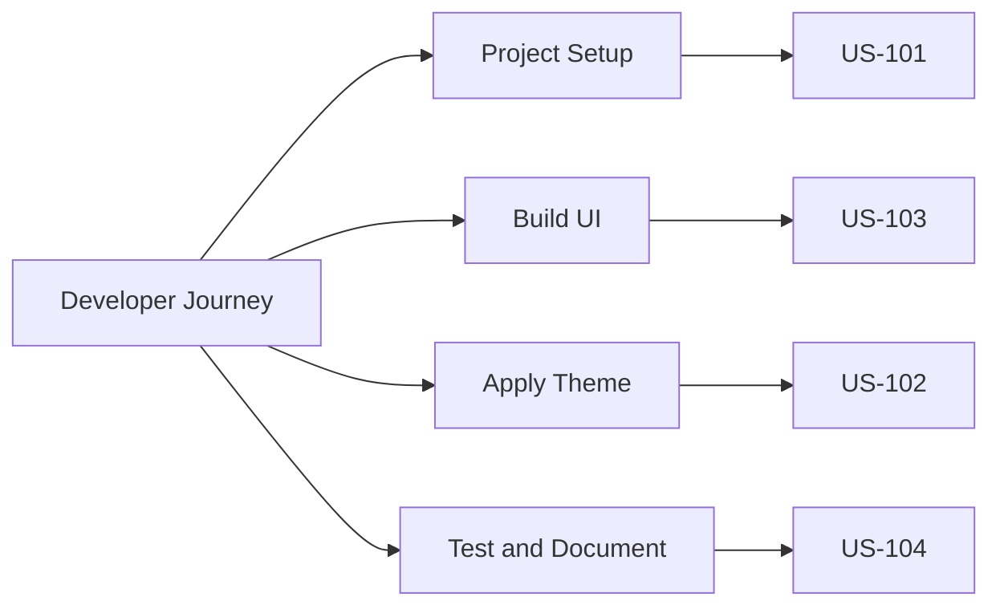

# User Stories and Acceptance Criteria

## Story Authoring Standard
- Format: "As a [role], I want [goal], so that [benefit]"
- Must satisfy INVEST criteria
- Include measurable acceptance criteria

## Prioritized User Stories
### US-101: Standardized Folder Structure
- **Story:** As a developer, I want a standardized folder structure so that I can navigate and scale features consistently.
- **Acceptance Criteria:**
  - `src/` contains `app`, `components`, `lib`, `hooks`, and `styles`
  - Route and layout conventions follow App Router standards
  - A short architecture README exists in [PLACEHOLDER: docs path]

### US-102: Fast Mobile Load Performance
- **Story:** As an end user, I want pages to load quickly on mobile so that I stay engaged.
- **Acceptance Criteria:**
  - Home page Lighthouse Performance score >= 90
  - LCP <= [PLACEHOLDER: target]
  - First load JS budget <= [PLACEHOLDER: KB]

### US-103: Consistent Visual Theme
- **Story:** As a stakeholder, I want visual consistency across landing pages so that brand recognition stays strong.
- **Acceptance Criteria:**
  - Shared tokens define colors, typography, and spacing
  - Light/Dark mode is persistent and flicker-free
  - Components pass visual regression checks

### US-104: Component Discoverability
- **Story:** As a developer, I want components documented in Storybook so that I can reuse them safely.
- **Acceptance Criteria:**
  - Each reusable UI component has a `.stories.tsx`
  - Controls and docs are visible in Storybook
  - [PLACEHOLDER: required accessibility stories]

## Story Map

## Definition of Ready (Stories)
- Business value is explicit
- Acceptance criteria are testable
- Dependencies and risks are known
- Story size is within one sprint
