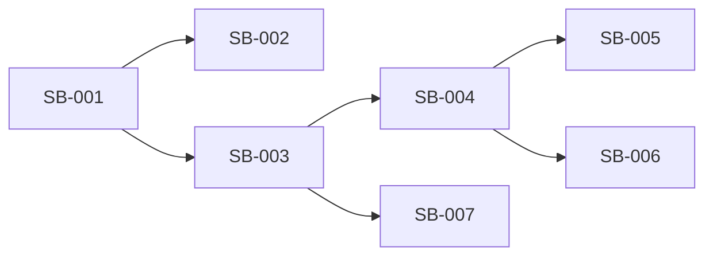

# Sprint Backlog

## Sprint Goal Link
See `01-sprint-goal.md`.

## Backlog Items
| Item ID | User Story | Task | Owner | Estimate | Status |
|---|---|---|---|---|---|
| SB-001 | US-101 | Initialize App Router structure | [PLACEHOLDER] | [PLACEHOLDER] | Todo |
| SB-002 | US-101 | Define shared project conventions | [PLACEHOLDER] | [PLACEHOLDER] | Todo |
| SB-003 | US-102 | Implement performant landing layout | [PLACEHOLDER] | [PLACEHOLDER] | Todo |
| SB-004 | US-103 | Build Hero + Features reusable sections | [PLACEHOLDER] | [PLACEHOLDER] | Todo |
| SB-005 | US-104 | Add Storybook stories for base components | [PLACEHOLDER] | [PLACEHOLDER] | Todo |
| SB-006 | US-103 | Theme token baseline and toggle wiring | [PLACEHOLDER] | [PLACEHOLDER] | Todo |
| SB-007 | US-102 | Add performance checks and budget validation | [PLACEHOLDER] | [PLACEHOLDER] | Todo |

## Dependency View

## Risks and Blockers
- [PLACEHOLDER: Third-party package compatibility]
- [PLACEHOLDER: Test environment constraints]
