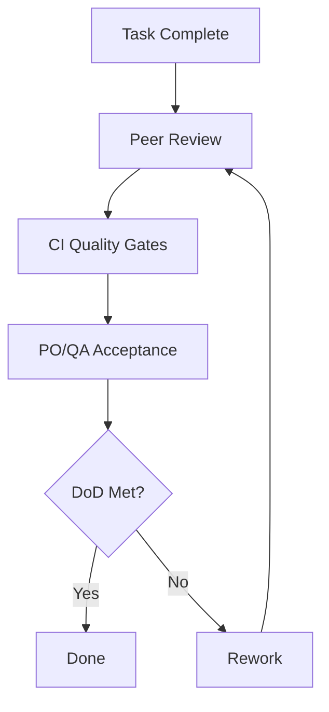

# Definition of Done (DoD)

## Purpose
Ensure every increment is potentially shippable and aligned with team quality standards.

## Global DoD Checklist
- Code merged via reviewed pull request
- Type checks, lint, and tests pass in CI
- No critical accessibility violations
- Performance budgets not breached
- Feature documented in relevant docs and/or Storybook
- Release notes input prepared

## Frontend-Specific Done Criteria
- Responsive behavior verified across target breakpoints
- Hydration issues validated and resolved
- Loading and error states implemented where needed
- Theming support validated in light/dark modes

## Evidence Required
- CI pipeline link: [PLACEHOLDER]
- Test evidence: [PLACEHOLDER]
- Demo link or screenshots: [PLACEHOLDER]

## DoD Compliance Flow

