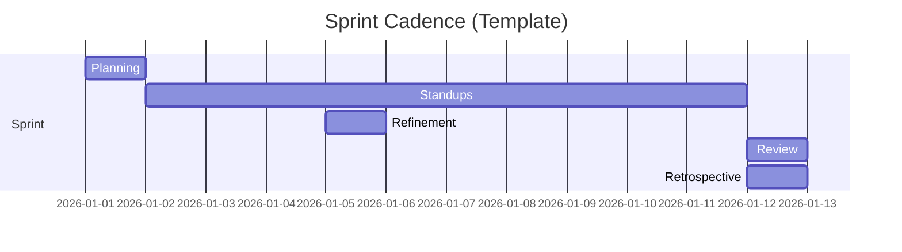

# Sprint Ceremonies Tracker

## Ceremony Cadence
| Ceremony | Purpose | Frequency | Duration | Participants |
|---|---|---|---|---|
| Sprint Planning | Commit to sprint scope and approach | Sprint start | 2-4h | Full team |
| Daily Standup | Sync progress and blockers | Daily | 15m | Delivery team |
| Backlog Refinement | Prepare future-ready stories | Weekly | 60m | PO + Tech + QA |
| Sprint Review | Inspect increment with stakeholders | Sprint end | 60m | Team + Stakeholders |
| Retrospective | Improve process and collaboration | Sprint end | 60m | Delivery team |

## Standup Template
- Yesterday: [PLACEHOLDER]
- Today: [PLACEHOLDER]
- Blockers: [PLACEHOLDER]

## Retrospective Actions
| Action | Owner | Due Date | Status |
|---|---|---|---|
| [PLACEHOLDER] | [PLACEHOLDER] | [PLACEHOLDER] | Open |
| [PLACEHOLDER] | [PLACEHOLDER] | [PLACEHOLDER] | Open |

## Sprint Ceremony Timeline

