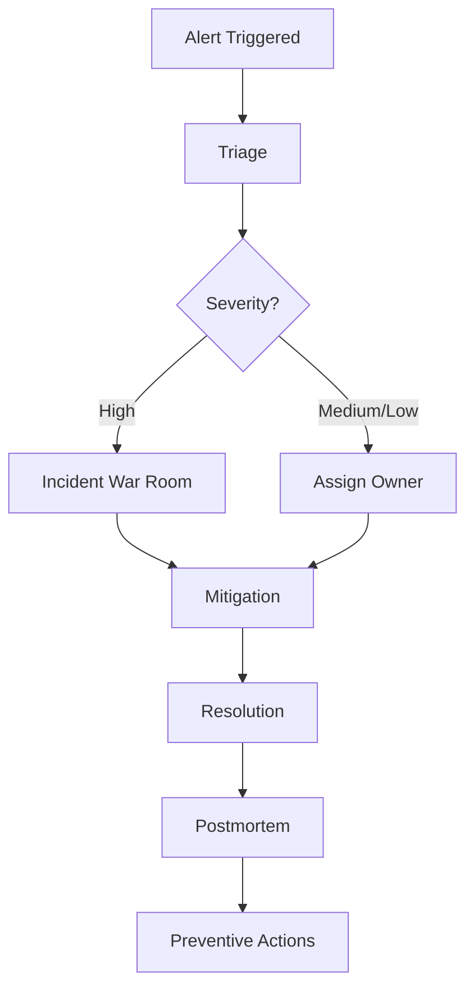

# Monitoring and Incident Response Plan

## Monitoring Scope
- Availability and error rates
- Core Web Vitals trends
- Build and deployment health
- Client-side exception telemetry

## Alerting Matrix
| Signal | Threshold | Severity | On-Call Action |
|---|---|---|---|
| Error rate spike | > [PLACEHOLDER]% in [PLACEHOLDER] min | High | Start incident triage immediately |
| LCP degradation | > [PLACEHOLDER] ms p75 | Medium | Investigate performance regression |
| Deployment failure | Any production failure | High | Roll back and open incident |
| Accessibility violation trend | > [PLACEHOLDER] critical findings | Medium | Create remediation task |

## Incident Workflow

## Postmortem Template
- Incident ID: [PLACEHOLDER]
- Timeline: [PLACEHOLDER]
- Root Cause: [PLACEHOLDER]
- Corrective Actions: [PLACEHOLDER]
