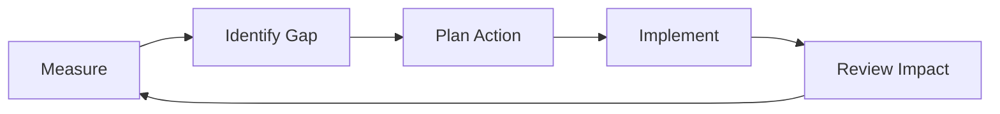

# Continuous Improvement Plan

## Objective
Use production feedback and delivery metrics to continuously improve product quality and team throughput.

## Improvement Inputs
- Retrospective actions
- Incident postmortems
- User feedback and support trends
- Delivery and quality metrics

## Quarterly Improvement Themes
| Theme | Baseline | Target | Owner | Due |
|---|---|---|---|---|
| Build speed optimization | [PLACEHOLDER] | [PLACEHOLDER] | [PLACEHOLDER] | [PLACEHOLDER] |
| Test reliability | [PLACEHOLDER] | [PLACEHOLDER] | [PLACEHOLDER] | [PLACEHOLDER] |
| Accessibility maturity | [PLACEHOLDER] | [PLACEHOLDER] | [PLACEHOLDER] | [PLACEHOLDER] |
| Documentation completeness | [PLACEHOLDER] | [PLACEHOLDER] | [PLACEHOLDER] | [PLACEHOLDER] |

## Improvement Loop

