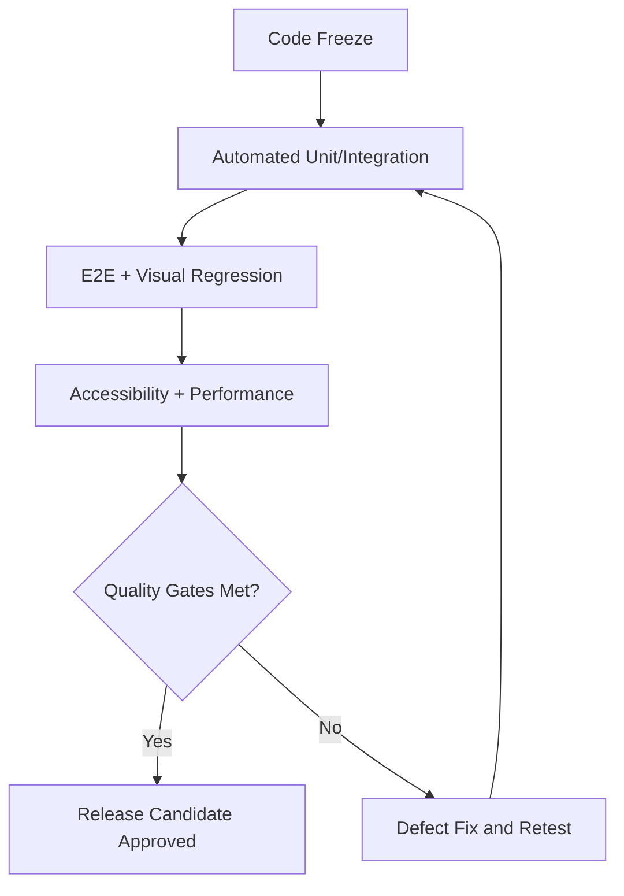

# QA Strategy and Test Plan

## Objective
Validate release quality across functionality, performance, accessibility, and visual consistency before production deployment.

## Test Pyramid
| Layer | Purpose | Suggested Tools | Entry Criteria |
|---|---|---|---|
| Unit | Validate isolated logic | [PLACEHOLDER: Vitest/Jest] | Code complete |
| Integration | Validate component behavior | [PLACEHOLDER: RTL] | Unit tests pass |
| E2E | Validate user journeys | [PLACEHOLDER: Playwright/Cypress] | Integration tests pass |
| Visual Regression | Catch unintended UI changes | [PLACEHOLDER: Chromatic] | Storybook updated |
| Accessibility | Ensure WCAG conformance | [PLACEHOLDER: Axe] | UI feature complete |

## Quality Gates
- Test pass rate >= [PLACEHOLDER]%
- Zero open critical defects
- No severity-1 accessibility violations
- Performance budgets within thresholds

## Test Execution Flow

