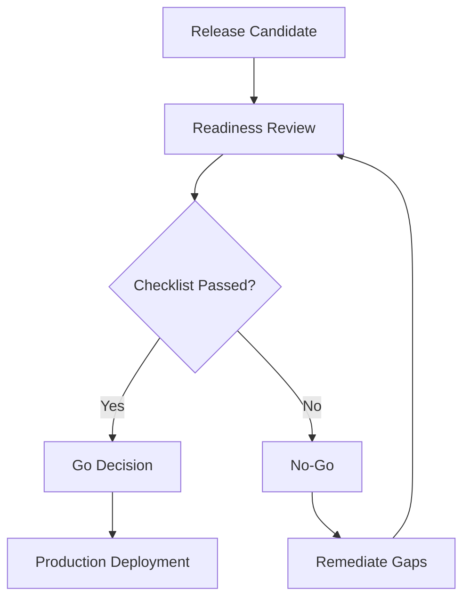

# Go/No-Go Checklist

## Release Readiness Checklist
| Area | Check | Status | Owner |
|---|---|---|---|
| Quality | All priority test suites pass | [PLACEHOLDER] | QA Lead |
| Defects | No unresolved Sev-1 defects | [PLACEHOLDER] | QA Lead |
| Performance | Budgets met in target environments | [PLACEHOLDER] | FE Lead |
| Security | Required checks complete | [PLACEHOLDER] | Security |
| Documentation | Release notes and runbook updated | [PLACEHOLDER] | Product Owner |
| Ops | Monitoring and alerting configured | [PLACEHOLDER] | DevOps |
| Rollback | Rollback plan tested/validated | [PLACEHOLDER] | DevOps |

## Decision Log
- **Decision:** [Go | Conditional Go | No-Go]
- **Date/Time:** [PLACEHOLDER]
- **Approvers:** [PLACEHOLDER]
- **Notes:** [PLACEHOLDER]

## Deployment Decision Flow

