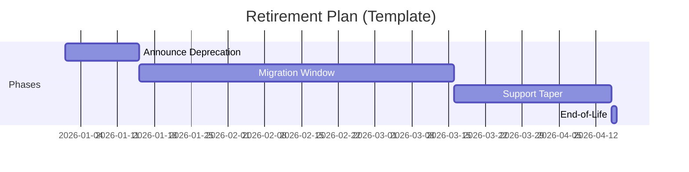

# Product Retirement Strategy

## Purpose
Define a controlled, low-risk end-of-life process for the current starter template when superseded.

## Retirement Triggers
- Framework paradigm shift reduces maintainability
- Security/compliance requirements cannot be met economically
- Official replacement template reaches production readiness
- [PLACEHOLDER: Business trigger]

## Stakeholder Impact
| Stakeholder | Impact | Required Action |
|---|---|---|
| Internal Developers | Must migrate active projects | Follow migration runbook |
| Delivery Managers | Re-plan delivery timelines | Update project baselines |
| Platform Team | Decommission support tooling | Disable deprecated pipelines |

## Retirement Timeline

## Exit Criteria
- All critical consumers migrated
- No active production dependencies remain
- Knowledge transfer and archival complete
