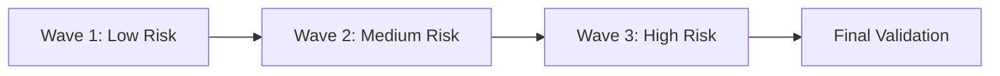

# Migration Runbook

## Objective
Provide a repeatable process for migrating from the retiring template to the next-generation baseline.

## Migration Preconditions
- Replacement template version: [PLACEHOLDER]
- Migration owner assigned per product squad
- Rollback and backup plan validated

## Step-by-Step Runbook
1. Inventory projects using the retiring template
2. Classify by complexity and business criticality
3. Map old architecture patterns to new equivalents
4. Execute pilot migration on a low-risk application
5. Roll out wave-based migration
6. Validate quality gates and sign-off

## Migration Wave Plan

## Validation Checklist
- Functional parity confirmed
- Performance and accessibility benchmarks maintained
- Monitoring and alerts configured
- Stakeholder sign-off captured

## Rollback Procedure
- Trigger: [PLACEHOLDER]
- Steps: [PLACEHOLDER]
