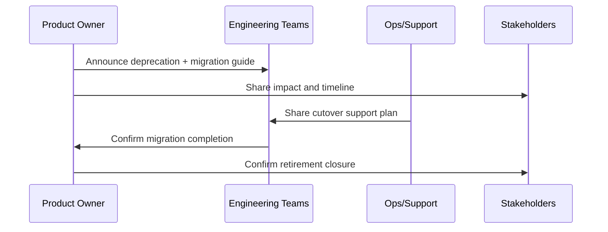

# Decommission Checklist and Communications Plan

## Decommission Checklist
| Area | Task | Owner | Status |
|---|---|---|---|
| Codebase | Archive legacy branches and tags | [PLACEHOLDER] | Pending |
| Tooling | Disable obsolete CI/CD jobs | [PLACEHOLDER] | Pending |
| Docs | Mark old docs as deprecated | [PLACEHOLDER] | Pending |
| Support | Close maintenance queues for retired template | [PLACEHOLDER] | Pending |
| Security | Revoke unused credentials/tokens | [PLACEHOLDER] | Pending |
| Governance | Record formal end-of-life approval | [PLACEHOLDER] | Pending |

## Communication Plan
| Audience | Message | Channel | Timing | Owner |
|---|---|---|---|---|
| Engineering teams | Deprecation and migration timeline | [PLACEHOLDER] | T-60 days | Product Owner |
| Stakeholders | Risk and delivery implications | [PLACEHOLDER] | T-45 days | Delivery Manager |
| Support/Ops | Cutover and escalation process | [PLACEHOLDER] | T-30 days | Ops Lead |

## Communication Sequence

## Sign-Off
- Final Approver: [PLACEHOLDER]
- Date: [PLACEHOLDER]
- Notes: [PLACEHOLDER]
